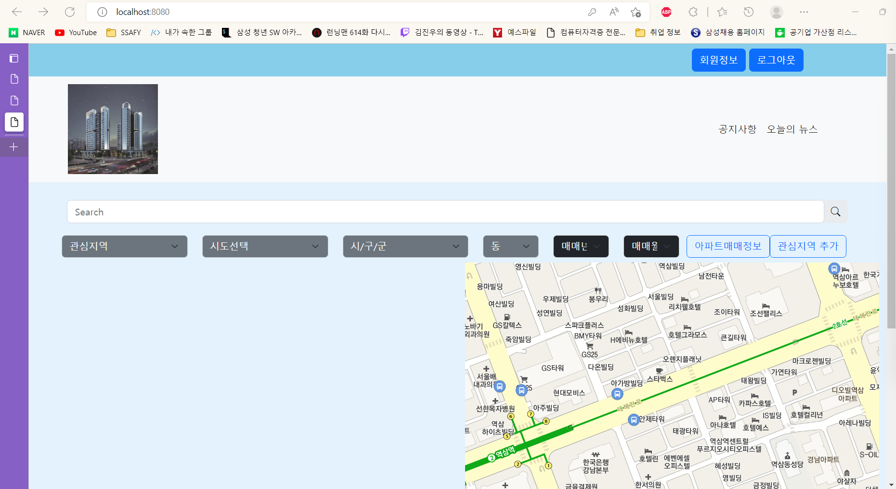
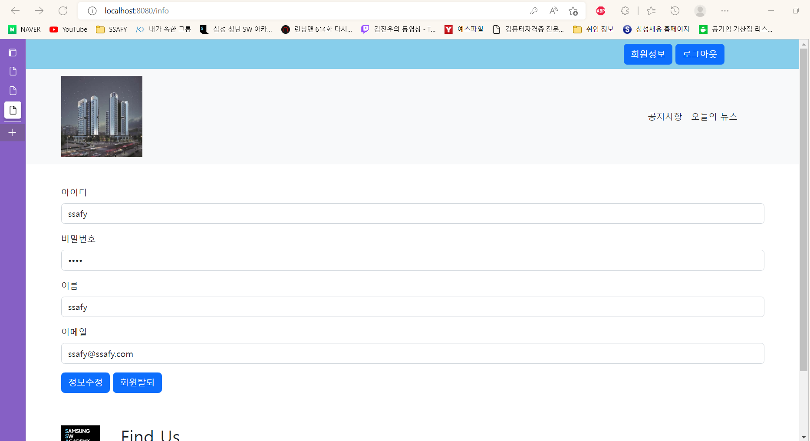
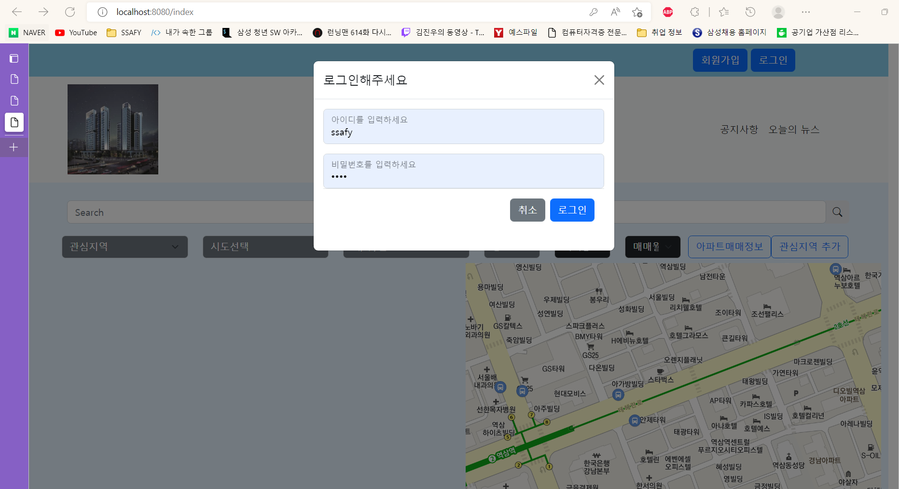
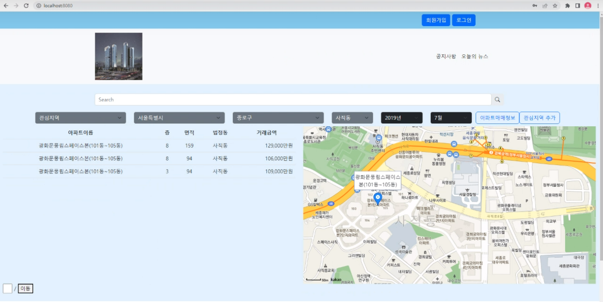

관통 프로젝트 제출 방법

# 관통프로젝트: MyHome_Framework_서울_11반_윤동균_정훈
### 제출일: 2022.11.02

### 참여 페어
- 윤동균(조장), 정훈

### 처리된 요구사항 목록
 
framework 분야
|난이도|구현기능(DB 구축 및 연결)|세부|작성여부(O/X)|
|:---:|---|---|:---:|
|기본|메인화면||O|
|기본|회원관리|회원정보 등록,수정,삭제,검색|O|
|기본|로그인/로그아웃||O|
|기본|실거래가 검색, 결과|전체검색화면|O|
|기본|실거래가 검색, 결과|상세검색화면|X|
|기본|실거래가 검색, 결과|동별화면|X|
|기본|실거래가 검색, 결과|아파트별검색화면|X|
|추가|비밀번호찾기/사이트맵/메뉴구성화면||X|
|추가|관심지역 동네 업종 정보 조회||X|
|추가|관심지역 대기오염 정보 조회||X|
|심화|웹사이트 소개/공지사항관리화면||X|

 
 

* 작성된 기능은 반드시 캡쳐되어야 합니다. 
* 추가로 구현한 기능을 표에 추가시키세요.

### 실행화면 캡쳐 - 
TODO: 요구사항 목록에서 완료 처리된 사항의 캡쳐 이미지를 등록하세요.

DB 구축 : select한 결과를 캡쳐해 주세요

구현 기능: 메인화면

구현 기능: 회원관리

구현 기능: 로그인/로그아웃

구현 기능: 아파트 리스트

